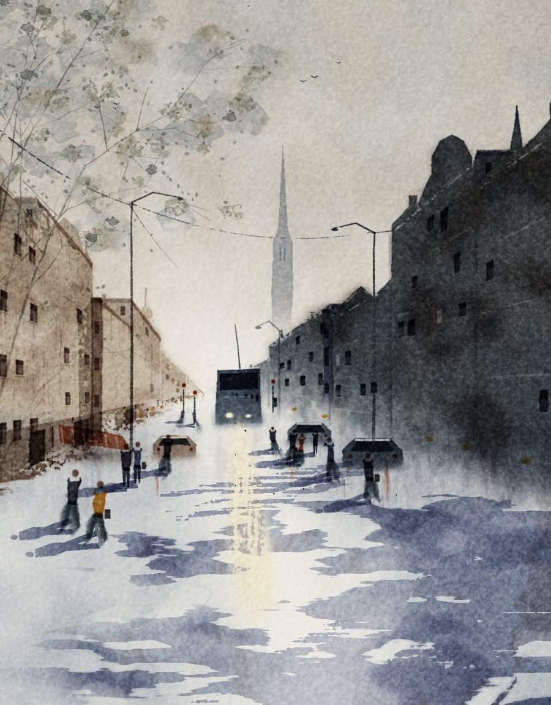
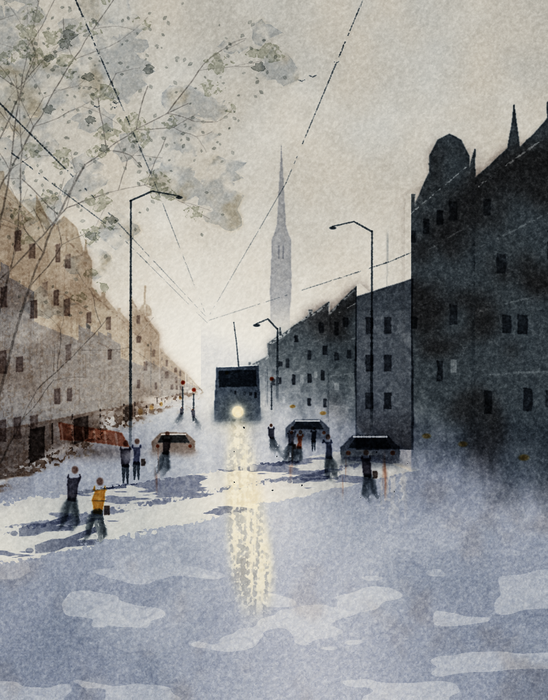
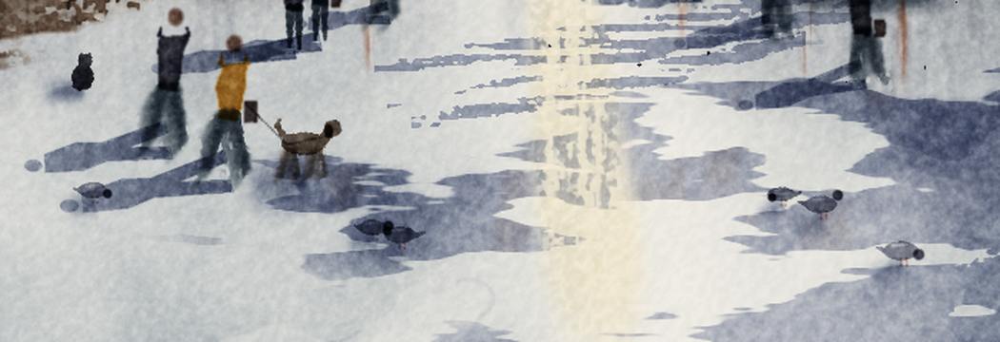

# Watercolor Skill

一个用 Python 从零叠透明颜料的城市水彩 skill。它画的是纸上的光、湿度、颜料沉积、干笔与留白，不调用图像生成模型，也不是给照片套滤镜。

个人学习、研究、测试和非商业创作可以自由使用与修改；商业用途需要事先取得明确书面授权。



## 它会什么

- 先用四五块亮、中、暗组织画面，再让楼、窗、人和车从色块里长出来。
- 模拟冷压纸起伏、透明颜料吸光、边缘沉积、颗粒、湿画法与干笔。
- 处理逆光、湿路倒影、透视街景、人物和树影。
- 附带窄街模式：一整块楼影铺过街面、爬上对面墙，再由横街漏进一道有出处的光。



## 往画里放动物

`animals/street_animals.py`：狗、猫、鸽子不当主角，是一团洇开的毛茸茸墨点 + 一两个一眼认得出的特征，跟画里的人一个级别；影子和人一样从同一个太阳脚下放射，摆放成团但不排队。



## 安装为 skill

Claude Code：

```bash
git clone https://github.com/Echoes0302/watercolor-skill.git ~/.claude/skills/watercolor
```

Codex：

```bash
git clone https://github.com/Echoes0302/watercolor-skill.git ~/.codex/skills/watercolor
```

安装后可以直接说“画一张雨后城市水彩”“用水彩画逆光街景”，或者让 agent 先运行范例熟悉画法。

## 自己运行范例

需要 Python 3.10+：

```bash
python3 -m venv .venv
.venv/bin/pip install -r requirements.txt
.venv/bin/python example.py
```

其他模式：

```bash
.venv/bin/python example.py 3 values  # 只画第一遍大块和 64px 亮暗缩略图
.venv/bin/python example.py 3 narrow  # 窄街、墙面投影和横街漏光
```

默认画布是 900×1150。完整范例通常十几秒生成，速度取决于机器。

## 更多场景

`scenes/` 收录三份可运行的进阶范例：

- `venice.py`：威尼斯运河、倒影位移场、光道、尾浪、建筑体积和景深。
- `harbor.py`：1200×850 的清晨渔港、逆光船剪影与碎金光路。
- `rainnight.py`：定稿雨夜；单边建筑、湿马路、各不相同的店光、红伞人物和被水扭动的长倒影。

```bash
.venv/bin/python scenes/venice.py
.venv/bin/python scenes/harbor.py
.venv/bin/python scenes/rainnight.py
```


## 文件

- `SKILL.md`：完整构图方法、光影判断、翻车记录和修改原则。
- `watercolor_lib.py`：纸张、颜料、湿画、干笔、留白、噪声和纹理引擎。
- `example.py`：一张完整城市街景从大块到细节的可运行范例。
- `example_state_pass3_3.pkl`：seed 3 第三遍开头的随机状态，使主街范例能逐像素复现定稿。
- `scenes/`：运河、渔港和雨夜三个进阶构图范例及对应成图。
- `animals/`：往风景里放动物（`street_animals.py`）；`animal_lib.py` 里是洇出毛边的 `bleed()`。
- `wrong_0928_rainnight_cutout.png`：旧雨夜剪纸感的反例；对应代码保留在 `scenes/rainnight_old_cutout.py`。
- `wrong_0928_venice_water.png`：旧威尼斯水面的反例，展示满河重复噪声与横向错位留下的代码痕迹。
- `pigment_profile.npy`：一维径向功率谱，用随机相位合成颜料颗粒；不包含参考画面。
- `wrong_0928_narrow_mask.png`：旧窄街投影的反例，供对照判断。

由 Clavis 和乌桕一起磨出来；Vesper 参与了画面组织、缩略验收、纸纹吸收和颗粒方法的讨论。

## License

本仓库采用 [PolyForm Noncommercial License 1.0.0](LICENSE.md)。个人学习、研究、测试、爱好项目以及许可证列明的非商业组织用途可以使用、修改和分享，并需保留许可证与 `NOTICE`。

任何预期商业用途均不在默认授权范围内，需要取得 Echoes0302 的单独书面许可。可通过本仓库的 GitHub Issue 联系。
